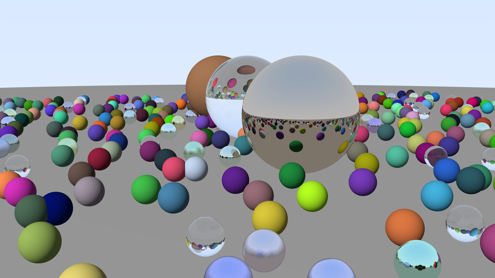

# raytracing

Ein **Echtzeit-Raytracer in Rust** — von Grund auf gebaut, in 10 nachvollziehbaren Schritten.
CPU-basiert, multithreaded, mit BVH-Beschleunigung und 4K-PNG-Export.



*4K, 64 Samples/Pixel, ~470 Kugeln mit Diffus-, Metall- und Glas-Materialien — gerendert in ~16 s.*

## Ausprobieren

**Interaktiv herumfliegen:**

```
cargo run --release
```

Steuerung: `W A S D` bewegen · `Space` / `Shift` hoch/runter · Pfeiltasten umschauen · `Esc` beenden.

**Ein hochaufgelöstes Standbild rendern** (speichert `render.png`):

```
cargo run --release -- render            # 4K, 64 Samples (~16 s)
cargo run --release -- render 1280 32    # schneller Test
cargo run --release -- render 3840 256   # ultra-glatt
```

## Wie es funktioniert


Die Kurzfassung:

```
für jeden Pixel:
    1. baue einen Strahl von der Kamera durch den Pixel
    2. finde das nächste getroffene Objekt        (Geometrie)
    3. bestimme die Farbe dort                     (Licht & Material)
    4. bei Metall/Glas: neuer Strahl, zurück zu 2  (Rekursion)
```

## Aufbau des Codes

| Datei | Inhalt |
|-------|--------|
| `vec3.rs` | 3D-Vektoren (Orte, Richtungen, Farben), Reflexion & Brechung |
| `ray.rs` | der Strahl `P(t) = O + t·D` |
| `camera.rs` | bewegliche Lochkamera mit Sichtfeld |
| `hittable.rs` | `Hittable`-Trait + Kugel + Strahl-Kugel-Schnitt |
| `material.rs` | Diffus / Metall / Glas |
| `aabb.rs`, `bvh.rs` | Beschleunigungsstruktur (Box-Hierarchie) |
| `main.rs` | Render-Schleife, Beleuchtung, Multithreading, PNG-Export |

Gebaut mit [`minifb`](https://crates.io/crates/minifb) (Fenster), [`rayon`](https://crates.io/crates/rayon) (Multithreading) und [`image`](https://crates.io/crates/image) (PNG).
